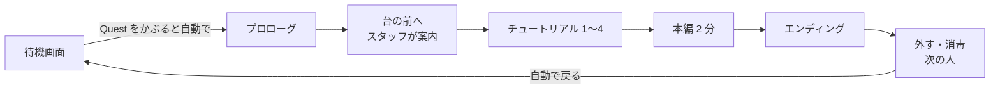

Temporal teaser

# MouthOfGod_System

AI生成により、不自然です。

> 触感デバイスで口の中に伝わる食感から食べ物・生物を特定し、それを生み出して世界（ミニチュアの村）を再構築するゲーム。
> *This game is ...*（TLDR 英文は応募時に確定）

IVRC に出展した作品を GDC 向けに再構成するプロジェクトです。IVRC 版との最大の違いは、**「ゲームとして成立させること（ゲーム性・チュートリアル設計）」** と **神様コンセプトの前面化** です。

# 開発
- Unity: **6000.0.73f1**
- 共同編集: Scene Fusion
# どうやって開発するか
- 開発の進め方: [CONTRIBUTING.md](./CONTRIBUTING.md)
- 設計方針と避けること: [docs/architecture.md](./docs/architecture.md)
- 決めたことと、採用しなかった案: [docs/decisions.md](./docs/decisions.md)
- 見た目の方針と、何にどの素材を使うか: [docs/visual-direction.md](./docs/visual-direction.md)
- やることと進み具合: 下の「[プロジェクト管理](#プロジェクト管理)」

## プロジェクト管理

やることはすべて **Issue** にし、**マイルストーン**に入れています。マイルストーンは、ゴール（応募動画 → 応募）に向かう**日付つきの区切り**です。期限の近い区切りから順に終わらせます。Issue 同士の順番は、各 Issue の右側にある **Relationships → Blocked by**（先に終わっている必要がある Issue）で表します。

**普段の流れ**
1. 下の「今の区切り」の「すぐ着手できる」から選ぶ。
2. 何日かかけて進めるなら、その Issue の **Assignee に自分を入れる**（「着手中」に出て、2 人が同じものを始めなくなる）。その日のうちに終わるときや、誰がやるか合意が取れているときは付けなくてよい（[CONTRIBUTING「作業の進め方」](CONTRIBUTING.md#作業の進め方)）。
3. PR で Issue を閉じる。図と活動記録は自動で更新される。
4. 週に 1 回（例: 月曜）、ロードマップを見て今週やるものを決める。⚠ が出ていたら、削るか後ろへ回すかを決める。

新しい Issue を作ったら、マイルストーン（どの区切りか）と Blocked by を設定する。

### 今の区切り

### 今の区切りのゴールと Issue

一番上（🎯）が今の区切りのゴールで、その下に「そのために先に要る Issue」が並びます。下から上へ進めます。🟨 すぐ着手できる、🟦 着手中、🟩 完了、↪ はほかの所に出てくる Issue、点線の箱は前の区切りの Issue です（画像を押すとロードマップ Issue に移ります。そこの図は、箱を押すとその Issue に移動できます）。

### 区切りの流れ

区切りごとの Issue の依存の図と、全区切りの表は、ピン留めした **[ロードマップ Issue](https://github.com/Fialuxe/MouthOfGod_System/issues?q=is%3Aissue+is%3Aopen+label%3Aroadmap)** にあります（GitHub Actions の [`roadmap.yml`](.github/workflows/roadmap.yml) が自動で更新するので、手で編集しない）。

### 活動記録

比べるためではなく、**自分がやったことを振り返るための記録**です。話し合い・調べもの・ものづくりなど、数字に出ない作業もたくさんあります。週ごとの数と、最近やったことの一覧は、ピン留めした **[活動記録 Issue](https://github.com/Fialuxe/MouthOfGod_System/issues?q=is%3Aissue+is%3Aopen+label%3Aactivity)** にあります。

---

## 1. コンセプト：あなたは神様

プレイヤーは、村で信仰されている神様です。

1. 神様は村から奉納された食べ物（お供え物）を食べて暮らしている。
2. その食感を覚えている。
3. ある日、村が食料難に陥る（木にリンゴがならない、川に魚が現れない）。
4. 神様は雲や霞を食べ、**お供え物と同じ食感のものを口から生み出して**、村を助ける。

> 「なぜこの操作をするのか」「なぜこの目的を達成したいのか」を、世界観が説明する。これが神様コンセプトの役割。

## 2. ゲームの骨子

| 項目 | 内容 |
|---|---|
| 目的 | 適切な食べ物を、適切な場所に届ける |
| 操作 | フォーク型のデバイスで雲を刺し、先を口に含んで噛む。食感は時間で変化し、狙った食感になった瞬間に決定すると、それが生み出される |
| チャレンジ | 口の中の感覚だけで「今のは牛だ」と見分ける |
| 成功 | 適切な食べ物を適切な場所に届けられた |
| 失敗 | 時間内に届けられなかった |
| スコア（仮） | 住民の満足度が高いほどハイスコア |
| 手応え | 自分が生み出したもので村が豊かになっていく |

### 体験のイメージ
- 目の前に、雪原・山・海・村のフィールドを持つミニチュアの村がある。
- 最初にお供え物を食べ、「食べ物と食感の対応」を覚える。
- フォーク型のデバイスで、周りに浮かぶ雲（霞）を刺し、その一部を口に含んで噛むと、食感が時間ごとに切り替わる。
- 出せるのは、はっきりした食べ物の食感（リンゴの食感など）ではなく、**見分けられる数種類の食感**。それぞれが 1 つの食べ物・生物に対応する（どれに対応させるかは #54）。
- 欲しい食感の瞬間にボタンで決定 → その食べ物・生物が口から生み出される。
- 必要な場所（例: リンゴ→村の木、魚→海。何をどこに届けるかは #54）に届ける。
- プレイヤーはミニチュアの周りを移動して場所を選ぶ。位置はコントローラーで取得する。

### IVRC 版からの変更点
| | IVRC | GDC |
|---|---|---|
| 復元される対象 | 食品だけ | 食品だけでなくてもよい（牛・魚などの生物も） |
| コンセプト | 神様コンセプトは裏設定 | **神様コンセプトを前面に** |
| ユーザーの移動 | 移動しない | 移動してもらう（見栄えのため） |

## 3. 体験フロー

**体験はすべて英語で行う**（語り・画面の文・スタッフの説明）。この節の文は日本語の下書きで、英語の文は [シナリオブック](docs/scenario-book.md)（仮）にある。

1 人あたり約 8 分（Quest をつけている間は約 6 分）。数字はすべて仮で、試遊しながら変える。詳しい案と経緯は [#38 のコメント](https://github.com/Fialuxe/MouthOfGod_System/issues/38#issuecomment-6083490067)。

| 場面 | 時間（仮） | どこで |
|---|---|---|
| 受付・説明・Quest とデバイスをつける | 1 分 | ブース（スタッフ） |
| プロローグ | 45 秒 | 座っても立ってもよい |
| 台の前へ | 15 秒 | スタッフが案内 |
| チュートリアル 1〜4 | 2 分 30 秒 | 台の前 |
| 本編 | 2 分 | 台の周り |
| エンディング | 30 秒 | 台の前 |
| 外す・消毒・次の人の準備 | 1 分 | ブース（スタッフ） |

GDC には 1 人あたりの時間の決まりはない。出展者の助言（デモは 10 分くらいに収める）を目安にする。混んだときのために、本編の制限時間は設定（データ）で変えられるようにする。

### プロローグ（仮）
**お供え物は食べず、見せるだけ**にする。食感は、台の前へ移動したあとのチュートリアルで初めて体験する。座って見ても、立って見てもよい。

伝えること（#21）:
- あなたは神です
- あなたは口からものうみだせます
- あなたはこの村の人々から信仰されていました
- ある日、村に飢饉が起こり、お供えものがなくなり、村の人達が困っています
- あなたの出番です
- さぁ、助けましょう的な

見せ方は 2 案（#38）。

**Case 1: 巻物 + 妖精サイズの巫女が説明する**（以下、巫女説明。括弧内は表示されるもの、体験者視界に表示されるものを示す）

> 昔々、○○という神がいての、、、（巻物や屏風など）
>
> その神は雲から農作物の始祖を生み出し、村の人々によく信仰されてたんじゃ、、、
>
> （画面フェードアウト、切り替わる）
>
> 村の人々は毎年、信仰してる神にお供え物をあげていての、、、（お供え物がQuest画面にでてくる）
>
> （画面フェードアウト、切り替わる）
>
> あるときのこと、その村は災害により飢饉に襲われてしまっての、、、（村に雨がふったり第三次な様子）
>
> その村では一切、自然の恵みが取れなくなってしまったんじゃ、、、（牛、豚、などが世界から消えていくような描写？）
>
> これより体験してもらうは、村の人々が語るその神の神話、そなたには神になりてその能力にて村を救うてもらう。驚くでないぞ、、、、
>
> 指示表示：チュートリアルが終わりました。立ちあがり、ブース担当者の指示を聞いてください

**Case 2: ウィジェット**

> ＊あなたには神になってもらいます。
>
> ＊その神はこの村で信仰されており、その口からこの村の人々の生活を支える自然の恵みをつくっていました。
>
> ＊あるとき、村には飢饉が訪れ、、、、
>
> 、、、説明はほぼ同じ

### チュートリアル
最終的にやらせたいこと（**場所に応じた食べ物を口の中から生成し、ミニチュアを豊かにする**）から逆算し、段階的に教える。簡単なことから本筋へ近づける。

1. お供え物を食べて、食べ物と食感の対応を覚える
2. デバイスの使い方を理解する（フォークで雲を刺して口に含む／噛むと食感が切り替わる／ボタンで決定）
3. 噛んで決定すると物が出てくることを知る
4. 出てきた物で何をしてほしいかを知る（必要な場所に届ける）
5. 木のフィールドで実際にやってみる（例：リンゴを木へ）
6. 木以外のフィールドでもできることを体験する（例：魚を川へ）

各ステップのゴールは「**どうやるか**を理解させること」。目的が分かりやすい状況を用意して、やりたいと思わせる。

6 ステップを、チュートリアル 1〜4 の Issue に次のように割り当てる。

| チュートリアル | 扱うステップ |
|---|---|
| 1（#12）デバイスの使い方 | 2 |
| 2（#13）噛むと物が生まれる | 1、3（お供え物はプロローグで見せるだけなので、食感はここで初めて体験する） |
| 3（#14）食感で物が変わる・要求を知る | 4 |
| 4（#15）届ける | 5、6 |

### メイン体験（本編）
**2 分（仮）のあいだ、村のあちこちで「これが欲しい」が出るので、歩いて行って、噛んで生み出して届ける。** 届けた分だけ村が豊かになる。**ここが「一番楽しいところ」。**

- **フィールド**: 雪原・山・海・村の 4 つ。どのフィールドが何を欲しがるかは #54 の対応表で決める。
- **欲しい物の出し方**: 村人の頭の上に吹き出しで出し、そのフィールドを光らせる。最初の 30 秒は 1 つずつ、あとは同時に最大 2 つ（どちらから行くかを選ぶ）。
- **間違えたとき**: 物が霞になって消え、村人が首を振る。欲しい物は残る。罰は付けず、失うのは時間だけ。
- **ゲーム性**:
  - 吹き出しに待ち時間のゲージ（20 秒）を付ける。間に合わないと村人ががっかりし、その分の満足度は入らない。
  - 食感は時間で切り替わるので、欲しい食感の瞬間に決定すること自体が腕前になる。
  - 間違えずに続けて届けると、ご褒美が大きくなる（下の「満足度とご褒美」）。
  - 難しさは、待ち時間の長さと同時に出る数で調整する（試遊でクリア率を見る。#16）。
- **終わり**: 残り 10 秒でカウントダウン。時間切れで止める（届けている途中の物は消す）。

### 満足度とご褒美
「やった！」をすぐに・何度も・少しずつ大きく感じさせて、もう 1 回届けたくなるようにする。

| ねらい | どう見せるか |
|---|---|
| すぐ返す | 届けた瞬間（0.5 秒以内）に、音・光・村人の歓声・「+満足度」が出る |
| 積み上がりが見える | 届けた物は村に残り、村が目に見えて育つ |
| 続けるほど大きく | 連続で当てると、音の高さが上がり、光が大きくなる。外すと元に戻る |
| ときどき大当たり | まれに「金のリンゴ」「村人が踊る」など、予想していないご褒美が出る |
| 惜しいを伝える | 外したとき、正解の食感が近かったら「惜しい！」と出す |
| 最後にためて見せる | エンディングで星を 1 つずつ発表する |
| 人と比べられる（案） | ブースのモニターに「今日の神様」上位を出す |

満足度の計算は単純にする（届けた数 × 連続ボーナス。#78）。細かい計算より、届けた瞬間の手応えを優先する。

### 体験終了（エンディング）
- プロローグと同じ語りで閉じる（例: 「そなたのおかげで、村に恵みが戻った…」）。
- カメラは動かさない（VR 酔いを避ける）。プレイヤーの周りの村が、届けた分だけ豊かになっているのを見せる。
- 星を 1 つずつ、間をためて出す（3 段階）。そのあと、豊かになった村全体と、笑顔の村人の数を見せる。満足度の数字は小さく添える。
- 最後に「体験は終わりです。デバイスを口から外して、そのままお待ちください」を出し、自動で待機画面に戻る。

### 途中でやめた・止まったとき
**キーボードも Inspector も使わない**。できるだけ自動にし、残りは Quest のコントローラーで操作する。

- **自動**:
  - 待機画面で Quest をかぶると、プロローグが始まる。
  - 途中で外すと一時停止し、つけ直すと続く。
  - 外したまま 30 秒たつか、エンディングが終わると、待機画面に戻る。村・欲しい物・満足度を初期状態（飢饉）に戻し、AprilTag の位置合わせは残す。
- **スタッフ**（左のコントローラーを持つ。誤操作を防ぐため、すべて長押し。押している間は視界の端にゲージを出す）:

| 操作（左のコントローラー） | すること |
|---|---|
| X を 2 秒長押し | 今の場面を飛ばして次へ |
| Y を 2 秒長押し | どこからでも待機画面に戻す |
| X と Y を同時に 3 秒長押し | デバイスが動かないとき、Mock 入力に切り替える（スティックで食感を切り替え、トリガーで決定） |

- プレイヤーの手（右のコントローラーのレイか、ハンドトラッキングか）は #62 で決める。ハンドトラッキングにするなら、スタッフのコントローラーと同時に使えるか（Meta XR SDK の Multimodal）を確かめる。

## 4. 未解決・要確認

| 項目 | 状況 |
|---|---|
| **食感の要素** | 未決定。「形状＋噛み心地」「水分量」のほか、形状再現のほうがよいのでは、という案もある。現行システムでは水分量による食感の完全再現は不可能という懸念あり。**食べ物そのものの食感（リンゴの食感など）ははっきり出せない**ので、見分けられる数種類の食感を物に対応させる。チュートリアルでは、噛んでいる間に生まれる物の影を見せて対応を覚えてもらい、本編では影を出さない（案。[シナリオブック](docs/scenario-book.md) S4） |
| 「設計図ベースのやつ」 | 以前話した案。チュートリアルにしやすいとのこと。内容の確認が必要 |
| スコア設計 | 満足度で見せる方針は決めた（「3. 体験フロー」の「満足度とご褒美」）。計算の細部は #78 |
| チュートリアルの具体ステップ | 上記は叩き台。確定していない |
| 生成対象 × 置き場所の組み合わせ | 未確定 |
| 成功・失敗の条件の詳細 | 制限時間は 2 分（仮）、届け間違いは時間を失うだけ、と決めた。1 回の要求の判定の細部は #61 |

## 5. 開発の進め方（概要）

- リポジトリ: https://github.com/Fialuxe/MouthOfGod_System
- Git ブランチ運用 + Scene Fusion。詳細は [CONTRIBUTING.md](./CONTRIBUTING.md) を参照。
- ブランチの使い分け: 機能は `feature/`、バグは `fix/`、シーン制作は `scene/`。
- 動作確認用シーンは `Assets/Scenes/Sandbox/` に自分専用のものを作る。
- アセットはローポリで統一すると調達しやすい。

## 資料

体験スペースと配置イメージ

雲を食べ物に変える瞬間のイメージ

## 6. 応募（GDC）

alt.ctrl.GDC 2027 に応募する。フォームの全項目と条件は [docs/alt-ctrl-gdc-application.md](docs/alt-ctrl-gdc-application.md)。

### 締切と提出物
- **締切: 2026/10/30**（時刻・時差は書かれていないので、**10/29（日本時間）に出す**）。応募は無料。
- 入選したら、**2027/3/1〜5 に San Francisco で展示**。旅費・宿は自分たちで払い、展示中は常に 1 人以上がブースにいる。

| 提出物 | 条件 | Issue |
|---|---|---|
| 審査用の動画 | 1 本・**5 分以内**。限定公開でよい | #70、#111 |
| 宣伝用の説明 | 英文 **50 語以内**。入選すると公開 | #73 |
| 何が特別で「alt」なのか | 英文 1 段落。この操作でしか作れない体験だと説明する | #73 |
| 展示スペースの図面 | **6 × 8 ft（約 1.8 × 2.4 m）** をどう使うか。応募の時点で要る | #89 |
| 題名・チーム・連絡先・住所など | 代表者 1 人（決定と請求の窓口）の名前・役割・メール・電話 | #116 |

### 動画審査
- 見られるのは**冒頭だけ**と考え、最初にゲーム内容を分かりやすく伝える。補足は後半へ。
- 「何をするゲームか」「チャレンジ内容と成功/失敗」「面白さ」を伝える。新規性は有利。
- 最も楽しいところだけを映せばよい。5 分より短くてよい。

| 構成 | 内容 |
|---|---|
| TLDR | どんなゲームかを一目で。文字＋プレイ画面。`This game is ...` |
| Concept | 世界観、やってほしいこと、避けたいこと。「あなたは神です」、なぜそれをやるのか |
| Play View | メイン体験の最も楽しい部分 |
| Appendix | デバイスの仕組みなどの補足 |

TLDR 案: *触感デバイスを使って口内に伝わってくる触感をもとに対応する食品・生物を特定し、それをもとに世界を再構築するゲーム*

### 方針の確認（相談メモより）
- 位置情報取得のためのコントローラー利用: 問題なし。
- 現在の案でも、時間内にできなければ失敗となるため、ゲームとして成立しうる。
- GDC のために用意すべき最重要項目は**ゲーム性**、とくに**チュートリアル設計**。
- 応募欄をきちんと埋めれば大丈夫。
